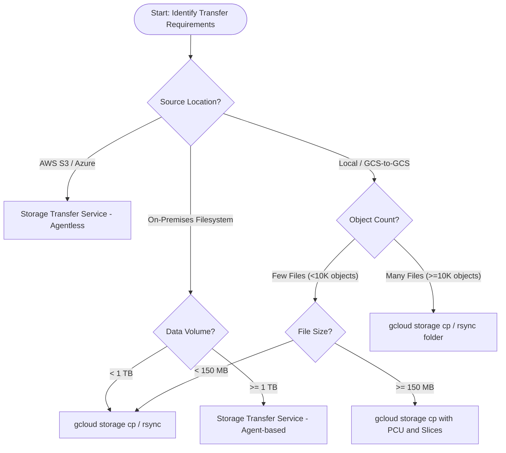

# GCS Data Transfer Operations

This reference guide provides detailed guidelines, a decision tree, and commands
for transferring data in and out of Google Cloud Storage (GCS). It covers single
file transfers, handling large files, managing high-concurrency transfers of
many small files, parallelizing using `gcloud storage`, and setting up Storage
Transfer Service (STS).

--------------------------------------------------------------------------------

## Decision Tree: Choosing the Best Transfer Method

Use the following flowchart and logic to choose the most efficient data transfer
method based on your host environment, dataset size, file count, and GCS bucket
settings.



### Detailed Decision Guidelines:

1.  **Cross-Cloud Migration (AWS S3, Azure Blob Storage):**
    *   *Recommendation:* Always use **Storage Transfer Service (STS)**. It runs
        serverless on Google infrastructure for cloud-to-cloud transfers,
        avoiding the need to funnel petabytes of data through a local machine or
        VM, saving egress and compute costs.
2.  **On-Premises Migration:**
    *   *Recommendation:* If the dataset is **under 1TB**, it is generally
        simpler to use the `gcloud storage` CLI (e.g. `gcloud storage cp -r` or
        `rsync`). If the dataset is **1TB or larger**, configure **Storage
        Transfer Service (STS)** using on-premises transfer agents.
3.  **Few Large Files (size >= 150MB, count < 10K):**
    *   *Recommendation:* Use `gcloud storage cp`. By default, it enables
        **Parallel Composite Uploads** (for writing) and **Sliced Downloads**
        (for reading) to thread chunk transfers.

### Inspecting Bucket Configuration

Before selecting a metadata transfer or loading strategy, query your bucket's
features to check for conflicts (such as Soft Delete, Versioning, Retention/Lock
policies, or storage class):

```bash
gcloud storage buckets describe gs://my-bucket/ --format="json(softDeletePolicy,versioning,retentionPolicy,storageClass)"
```

--------------------------------------------------------------------------------

## 1. Single File Upload and Download with gcloud CLI

For simple, single-file transfers, use the `gcloud storage cp` command.

*   **Upload a local file to GCS:**

    ```bash
    gcloud storage cp /path/to/local/file.txt gs://my-bucket/destination-folder/
    ```

*   **Download an object from GCS to local directory:**

    ```bash
    gcloud storage cp gs://my-bucket/destination-folder/file.txt /path/to/local/dir/
    ```

--------------------------------------------------------------------------------

## 2. Transferring Large Files (Parallel Upload & Sliced Download)

When dealing with large files, the `gcloud` CLI automatically optimizes
performance by splitting files into chunks for concurrent uploads and downloads.

### A. Parallel Composite Uploads (PCU)

By default, `gcloud storage cp` uses GCS JSON API's **Parallel Composite
Uploads** for large files.

*   **How it works:** The source file is divided into chunks, which are uploaded
    in parallel to GCS as temporary composite components. The components are
    then merged into a single final GCS object using the GCS `compose` API.
*   **Checksum behavior:** Because it uses the `compose` API, the final
    assembled object will have a **CRC32C** checksum instead of an MD5 hash.
    Non-composite uploads — single-shot or resumable, which is what `gcloud
    storage cp` performs when the file is below the threshold or PCU is disabled
    — do store an MD5 hash, so pipelines that verify per-object MD5 should
    disable PCU (or raise the threshold) rather than work around it.
*   **Tuning Properties:**

    *   **Enable/Disable:**

        ```bash
        gcloud config set storage/parallel_composite_upload_enabled True  # Or False to disable
        ```

    *   **Threshold:**

        ```bash
        gcloud config set storage/parallel_composite_upload_threshold 150M  # e.g., 150MB
        ```

    *   **Component Size:**

        ```bash
        gcloud config set storage/parallel_composite_upload_component_size 50M # e.g., 50MB
        ```

> [!IMPORTANT] Do not use Parallel Composite Uploads if your bucket has a
> retention policy enabled, because the temporary objects can't be deleted until
> they meet the retention period. By default, gcloud protects against this:
> `storage/parallel_composite_upload_compatibility_check` (default `True`) skips
> PCU unless the object's storage class is STANDARD and the destination bucket
> has no retention policy and no default object holds — the conflict only arises
> if that check has been set to `False`. While Soft Delete and Object Versioning
> do not prevent PCU from working, they can significantly increase storage costs
> because deleted temporary components remain on the bucket.

For pipelines that compose objects themselves (chunked uploads merged with
`gcloud storage objects compose`), avoid those soft-delete/versioning costs by
hard-deleting the temporary components *during* composition instead of deleting
them afterwards: `gcloud storage objects compose gs://B/chunk1 gs://B/chunk2
gs://B/final --delete-source-objects` hard-deletes the source objects as part of
the compose operation, so they never become soft-deleted or noncurrent versions
while bucket-level protections stay on for the final objects.

### B. Sliced Object Downloads

For downloading large files, the `gcloud` CLI executes ranged GET requests
(slices) in parallel, writing files concurrently into pre-allocated placeholders
in the local destination.

*   **Checksum validation:** To verify the data integrity of the downloaded
    slices, `gcloud` uses CRC32C checksums.
*   **Tuning Properties:**

    *   **Threshold:**

        ```bash
        gcloud config set storage/sliced_object_download_threshold 0  # Set to 0 to disable sliced downloads
        ```

> [!IMPORTANT] Sliced downloads require a compiled `crcmod` Python package on
> the host machine. If a compiled `crcmod` is not available, `gcloud` CLI prints
> a warning and automatically falls back to slower sequential downloading. By
> default, `gcloud` dynamically autotunes slice triggers and components.

--------------------------------------------------------------------------------

## 4. Scaling Concurrent Multi-File Transfers with gcloud CLI

`gcloud storage` is natively thread-safe and parallel by default.

### Tuning Concurrency Controls

Concurrency inside `gcloud` is auto-tuned by default. If performance is poor or
resource limits are hit, process and thread values can be adjusted:

1.  **Process Count:**

    ```bash
    gcloud config set storage/process_count 8
    # Or env variable: CLOUDSDK_STORAGE_PROCESS_COUNT=8
    ```

2.  **Thread Count:**

    ```bash
    gcloud config set storage/thread_count 8
    # Or env variable: CLOUDSDK_STORAGE_THREAD_COUNT=8
    ```

To disable concurrency entirely for sequential execution (e.g. debugging, rate
limit issues), set both values to `1`:

```bash
gcloud config set storage/process_count 1
gcloud config set storage/thread_count 1
```

To recursively upload or download directories containing many files, use the
`--recursive` or `-r` flag:

```bash
# Recursively upload a local directory to a bucket in parallel
gcloud storage cp -r ./local-directory gs://my-bucket/

# Recursively download a bucket prefix to a local directory in parallel
gcloud storage cp -r gs://my-bucket/backup-dir/ ./local-restore-dir/
```

### Syncing Directories with `gcloud storage rsync`

For synchronizing rather than copying, use `rsync`, which also runs in parallel
by default:

```bash
# Sync local directory to cloud (compares modification time and size, uploads missing/modified files, doesn't delete unmatched)
gcloud storage rsync ./my-data-folder gs://my-bucket/synced-data/ --recursive
```

--------------------------------------------------------------------------------

## 5. Storage Transfer Service (STS) for S3 and Azure Migrations

For multi-terabyte or petabyte-scale data transfers from Amazon S3, Microsoft
Azure, or public/private HTTP sources to GCS, use the **Storage Transfer Service
(STS)**. STS runs transitions between cloud providers asynchronously on Google
infrastructure without using local network or VM bandwidth. (Transfers from
on-premises sources require deploying on-premises transfer agents).

STS also supports Amazon S3 sources in **AWS GovCloud (US) regions**
(`us-gov-east-1` and `us-gov-west-1`), for both one-time/batch and event-driven
transfers. GovCloud sources use the `arn:aws-us-gov:` ARN prefix (for example
`arn:aws-us-gov:iam::AWS_ACCOUNT:role/ROLE_NAME`); transfers over the managed
private network are not available for GovCloud regions.

### A. Prerequisites for Storage Transfer Service (STS)

Before creating a transfer job, complete the following steps:

1.  **Enable the API:**

    ```bash
    gcloud services enable storagetransfer.googleapis.com
    ```

2.  **Grant the STS service agent access to the destination bucket:** The
    service agent
    (`project-PROJECT_NUMBER@storage-transfer-service.iam.gserviceaccount.com`)
    needs `roles/storage.legacyBucketWriter` on the destination bucket. If the
    overwrite option is set to check for "different" or "never", it also needs
    `roles/storage.objectViewer`.

    *   **Grant permission command:**

        ```bash
        gcloud storage buckets add-iam-policy-binding gs://DESTINATION_BUCKET_NAME \
            --member="serviceAccount:project-PROJECT_NUMBER@storage-transfer-service.iam.gserviceaccount.com" \
            --role="roles/storage.legacyBucketWriter"
        ```

### B. Credentials JSON File Setup

To authorize read access to your source without putting secret keys into CLI
command arguments, construct a local JSON credential file.

*   **For Amazon S3 (`s3-creds.json`):**

    ```json
    {
      "accessKeyId": "AWS_ACCESS_KEY_ID",
      "secretAccessKey": "AWS_SECRET_ACCESS_KEY"
    }
    ```

*   **For Azure Blob Storage (`azure-creds.json`):**

    ```json
    {
      "sasToken": "AZURE_SHARE_ACCESS_SIGNATURE_TOKEN"
    }
    ```

### C. STS Commands

#### Create a Transfer Job from Amazon S3:

```bash
gcloud transfer jobs create s3://my-aws-s3-bucket/ gs://my-gcs-destination-bucket/ \
    --source-creds-file=s3-creds.json \
    --description="One-time S3 migration to GCS" \
    --name="s3-to-gcs-migration"
```

#### Create a Transfer Job from Azure Blob Storage:

Specify the Azure Blob Storage container endpoint as the source:

```bash
gcloud transfer jobs create https://myazurestorageaccount.blob.core.windows.net/mycontainer/ gs://my-gcs-destination-bucket/ \
    --source-creds-file=azure-creds.json \
    --description="One-time Azure container migration to GCS" \
    --name="azure-to-gcs-migration"
```

#### Additional STS CLI Operations:

*   **Describe the job status and details:**

    ```bash
    gcloud transfer jobs describe s3-to-gcs-migration
    ```

*   **Run a saved transfer job immediately:**

    ```bash
    gcloud transfer jobs run s3-to-gcs-migration
    ```

*   **Monitor progress of the current transfer run in real time:**

    ```bash
    gcloud transfer jobs monitor s3-to-gcs-migration
    ```

*   **List all existing STS transfer jobs:**

    ```bash
    gcloud transfer jobs list
    ```
