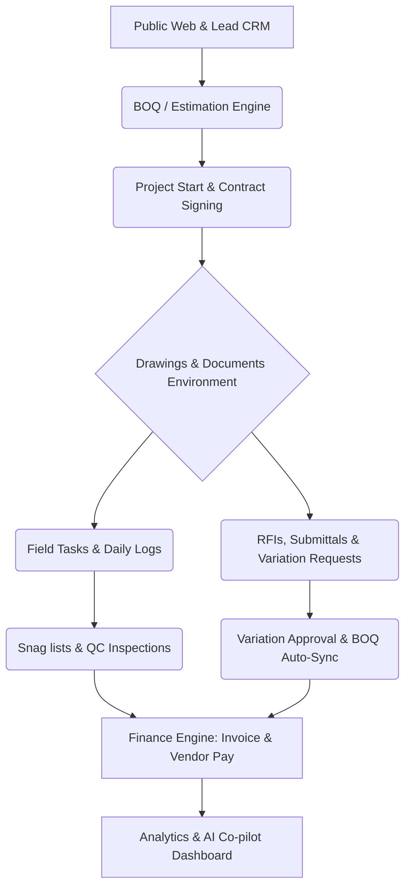
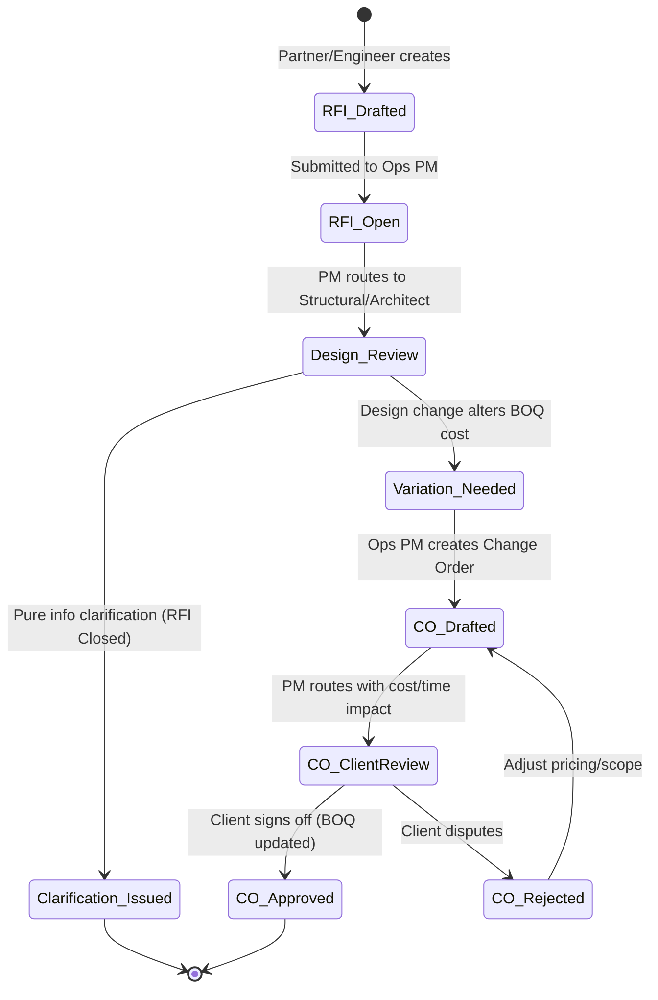
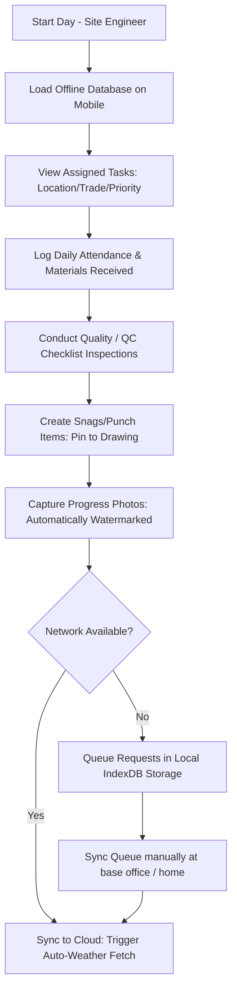
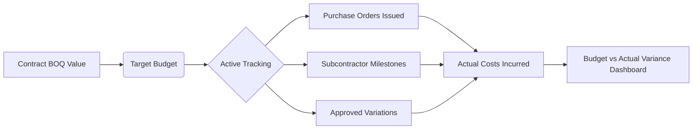
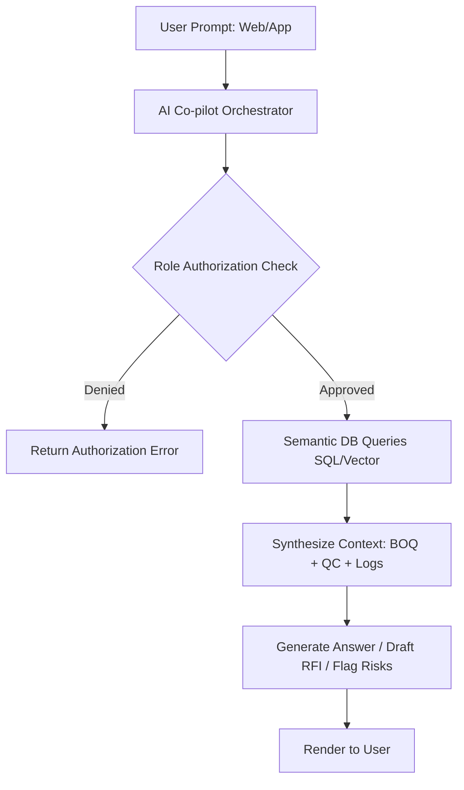

# Buildogram – Advanced Feature Mapping & PRD Expansion

This document presents a comprehensive, high-fidelity Product Requirements Document (PRD) expansion for **Buildogram**, absorbing the best-in-class capabilities from market-leading platforms (**RDash, Procore, Autodesk Construction Cloud, Buildertrend, and Fieldwire**). 

---

## 1. Core Feature Mapping

Below is the mapping of advanced capabilities from source platforms into Buildogram's existing three-portal architecture (Client Portal, Partner/Supplier Portal, Internal Ops Console) and core engines, with staging priorities:
- **v1 (Must-have)**: Core workflows required for baseline project control, basic mobile logging, and basic contract enforcement.
- **Phase 2**: Advanced automated workflows, offline sync engines, and dynamic integrations.
- **Future/Optional**: BIM (3D model coordination) and fully automated predictive modeling.

| Advanced Feature | Source Platform(s) | Buildogram Target Module | Target Portal / Engine | Priority |
| :--- | :--- | :--- | :--- | :--- |
| **Offline HD Plan Viewer & Annotations** | Fieldwire / Procore | Drawings & Docs Module | Client, Partner & Ops (Mobile + Web) | **v1** (Viewer); **Phase 2** (Offline Sync & Redline Markups) |
| **Task Management & Work Breakdown** | Fieldwire / Buildertrend / RDash | Daily Logs & Tasks Module | Partner & Ops (Mobile + Web) | **v1** |
| **Daily Logs & Weather Automation** | Fieldwire / Buildertrend | Daily Logs & Tasks Module | Partner & Ops (Mobile) | **v1** (Manual); **Phase 2** (Weather API Automation) |
| **RFI Lifecycle Management** | Procore / Fieldwire | RFIs & Submittals Module | Partner & Ops (Mobile + Web) | **v1** |
| **Submittals Tracking & Register** | Procore | RFIs & Submittals Module | Partner & Ops (Web) | **Phase 2** |
| **Change-Order Workflow & BOQ Sync** | Procore / RDash / Buildertrend | RFIs & Submittals Module | Client (Approve), Partner (Request), Ops (Verify) | **v1** |
| **Budget vs. Actual Cost Management** | Procore / Buildertrend | Finance Module | Ops Console & Analytics | **v1** |
| **Snag & Punch List QC Integration** | Fieldwire / RDash / Buildnext | QC Engine | Partner & Ops (Mobile) | **v1** |
| **Budget & Variation Approval Hierarchies**| Procore / RDash | Finance & Ops Admin | Ops Console (Web) | **v1** |
| **Integrated Sales CRM (Lead to Proposal)** | Buildertrend | Sales/CRM Engine | Ops Console (Web) | **v1** |
| **AI Co-pilot (Buildogram AI)** | RDash | Analytics & AI Engine | Client (Limited), Partner, Ops | **Phase 2** (Analytics); **Future** (Predictive Overruns) |
| **QuickBooks/Xero Accounting Sync** | Buildertrend | Finance Module | Ops Console (Backend Integration) | **Phase 2** |
| **BIM & 3D Model Coordination** | Procore / Autodesk ACC | Drawings & Docs Module | Ops & Client (Web Viewer) | **Future/Optional** |

---

## 2. Revised PRD Outline

To implement these capabilities without diluting Buildogram’s primary value proposition—**Engineer-led, BOQ-true, Chennai-localized construction CaaS**—we inject them into the standard PRD structure:

### Expanded PRD Section Revisions:
* **Section 5: High-Level System Components** (Updated to include *Drawings Common Data Environment (CDE)*, *Task Kanban Boards*, *RFI registers*, *Approval Routing Queues*, and *AI Database Vector Store*).
* **Section 6.1 (Client Portal)** (Updated with *Interactive Change-Order Approvals*, *Real-Time Budget Tracking*, and *Client AI Assistant*).
* **Section 6.2 (Partner Portal)** (Updated with *Offline Tasks Checklist*, *Mobile RFI Submission*, and *Subcontractor Variation Requests*).
* **Section 6.3 (Ops Console)** (Updated with *B2B Sales Pipeline Dashboard*, *Dynamic Variation Routing Queues*, *Drawings Overlay comparisons*, and *BOM/PO Auto-Reconciliation*).
* **Section 6.4 (QC Engine)** (Updated with *Visual Snag Markers directly on Layout Blueprints* and *Photovoltaic/Thermal Moisture Scans integration*).
* **Section 6.8 (Analytics & Risk)** (Expanded to include *Schedule Slip Risk Analysis*, *Cashflow S-Curve projections*, and *Subcontractor Productivity Ratings*).

---

## 3. Detailed Modules Specifications

### 3.1 RFIs, Submittals & Change Orders Module

This module ensures that any field query, material selection approval, or design change is tracked, priced, and approved with zero oral agreements.

#### A. Data Schema Key Fields
* **RFI Object**: `rfi_id`, `project_id`, `subject`, `description`, `originator_id` (subcontractor/field engineer), `assigned_pm_id`, `assigned_architect_id`, `drawing_id`, `drawing_coordinates` (JSON: `{x, y, zoom}` bounds), `impact_cost_estimate`, `impact_schedule_days`, `status` (Draft, Open, Under-Review, Resolved, Closed).
* **Submittal Object**: `submittal_id`, `project_id`, `spec_section` (e.g., Tiling-Kajaria-Royal), `description`, `manufacturer_brand`, `sample_photo_url`, `assigned_approver_id` (IIT-M Structural Lead / Client Architect), `response` (Approved, Approved-As-Noted, Revise-And-Resubmit, Rejected).
* **Change Order (CO) Object**: `change_order_id`, `rfi_id` (optional link), `project_id`, `title`, `description`, `reason_code` (Client Request, Site Condition, Design Discrepancy), `additional_cost`, `schedule_impact_days`, `original_boq_item_id`, `new_boq_item_id`, `client_approval_signature`, `status` (Draft, Under-Review, Approved, Rejected, Merged).

#### B. Variation Approval Workflow
1. **Initiation**: A variation is flagged during RFI resolution or requested directly by the client.
2. **Impact Assessment**: The BOQ engine calculates the cost difference automatically based on the locked material master rates.
3. **Approval Hierarchy Gating**:
   - **Cost < ₹25,000 & Schedule Impact < 2 days**: Auto-routing to Site PM for approval.
   - **Cost ₹25,000 – ₹2,00,000 & Schedule < 7 days**: Routed to Construction Operations Head.
   - **Cost > ₹2,00,000 or Schedule > 7 days**: Routed to VP of Construction / Structural Head.
4. **Client Sign-off**: Once approved internally, the Change Order is pushed to the Client Portal. The client clicks to approve, triggering an OTP signature.
5. **BOQ Auto-Sync**: Upon client approval, the system adds the new line items to the project's **Active BOQ Version** and updates the payment milestones.

---

### 3.2 Daily Logs & Tasks Module

The bridge between field execution and management dashboards. It allows site engineers to record physical progress offline and syncs automated context data when connectivity is restored.

#### A. Task Construction Metadata
Every task in Buildogram must belong to a spatial hierarchy to prevent vagueness (e.g., "Plastering").
* **Location ID**: Area (e.g., Block A) → Floor (e.g., First Floor) → Room (e.g., Master Bathroom).
* **Trade Code**: (Civil, Electrical, Plumbing, Tiling, Waterproofing, Structural).
* **Priority Level**: Critical Path, High, Medium, Low.
* **Assigned Owner**: Lead Subcontractor ID & Site Inspector ID.

#### B. Offline Synchronization Strategy
1. **Local Storage**: The mobile app caches the latest project database using **IndexedDB** (via RxDB or WatermelonDB) including tasks, blueprints, and active QC templates.
2. **Transaction Queue**: Actions taken offline (resolving a task, logging materials, raising a snag) are appended to a FIFO Queue in local storage.
3. **Conflict Resolution**:
   - *Case 1 (Timestamp Ordering)*: If a task status was changed by two users offline, the latest timestamp wins.
   - *Case 2 (RFI/Submittals)*: If a PM resolves an RFI while a field engineer updates it, the PM's status remains dominant, but the field engineer's notes are appended as a comment.
4. **Automatic Weather Fetch**: When a Daily Log is synced to the cloud, the backend calls a regional weather API (e.g., OpenWeatherMap using Chennai coordinates) to automatically capture:
   - Humidity (%), Rainfall (mm), Wind Speed (km/h), Temperature (°C).
   - *Engineering Guardrail*: If Rainfall > 5mm is detected, the system automatically tags the concrete curing log for that day with a moisture alert.

---

### 3.3 Drawings & Document Management Module

A centralized, single-source-of-truth Common Data Environment (CDE) for drawings, ensuring site engineers never build using outdated structural details.

#### A. Document & Version Control Control Flow
* **File Structure**: Organized by disciplines: *Architectural*, *Structural*, *MEP (Mechanical/Electrical/Plumbing)*, *3D Renders*.
* **Auto-Overlay Vector Engine**: When a new version of a structural drawing (PDF/DWG) is uploaded, the Web Viewer renders the old sheet in **red** and the new sheet in **blue**, letting the PM instantly see modifications (e.g., reinforced column widths).
* **Sheet Revision Status**: Explicit status tags: `Issued for Construction (IFC)`, `Draft`, `As-Built`, `Superseded`.
* **Automatic Cloud Watermarking**: Older sheets are automatically watermarked with a large red **"SUPERSEDED – DO NOT USE FOR CONSTRUCTION"** diagonal text to prevent field errors.

#### B. Mobile Annotations & Markup
* **Tools**: Freehand draw, clouds, text callouts, photo attachments, and measure lines.
* **Coordination Coordinates**: Every annotation stores relative vector coordinates `{x, y}` rather than absolute pixels to ensure perfect rendering across varying screen sizes (iPad, Android tablet, smartphone).
* **Direct Linking**: An annotation can be linked to an RFI or a Snag Item. Clicking the cloud on the drawing opens the RFI detail sheet.

---

### 3.4 Financial Management Module

Provides continuous cost-to-complete metrics by comparing the estimated BOQ directly with purchase orders, invoices, and variation impacts.

#### A. Core Ledgers & Calculations
1. **Target Budget (Planned Value)**: Generated directly from the baseline BOQ.
2. **Committed Cost**: Total value of all approved Purchase Orders (POs) issued to material suppliers + subcontract agreements signed.
3. **Actual Cost**: Payments disbursed for materials delivered + milestone payouts processed to contractors.
4. **Project Cost Variance (CV)**:
   $$\text{CV} = \text{Target Budget} - \text{Actual Cost}$$
5. **Estimate At Completion (EAC)**:
   $$\text{EAC} = \text{Actual Cost} + \text{Remaining BOQ Work (factoring current cost variance)}$$

#### B. Accounting & Invoicing Systems
* **Client Billing**:
  - *Option A (Milestone-based)*: Linked strictly to physical milestones verified by QC inspections (e.g., Plinth completion, Slab 1 casting).
  - *Option B (Progressive billing)*: Percentage-of-completion calculations based on itemized BOQ measurement sheets (Measurements Book).
* **Vendor Billing (Reconciliation)**: Auto-matching system:
  $$\text{Purchase Order} \longleftrightarrow \text{Gate Entry Delivery Slip} \longleftrightarrow \text{Supplier Invoice}$$
  If unit rates or quantities deviate by $>2\%$, the invoice is routed to the Finance Head for manual audit.
* **Change-Order Adjustment**: Approved variations automatically recalculate the target budget, adjusting the client invoicing ledger.

---

## 4. Buildogram AI – Co-pilot Specifications

An intelligent agent built directly into the database layers to give users plain-English access to complex analytics and automation.

### 4.1 Plain-English Prompt Scope & Target Use Cases
* **Querying Status**: *"What is the cost variance on the ECR Villa project right now, and which items caused the overrun?"*
* **Drafting Documents**: *"Draft an RFI for the Structural Engineer about the column reinforcement discrepancy on Grid 4 of Floor 1, linking it to drawing sheet S-102."*
* **Generating Daily Summaries**: *"Summarize yesterday's work across all active Chennai sites, highlighting any concrete slump test failures."*
* **Surfacing Risk**: *"Analyze the schedule risk for the Velachery project based on daily logs and recent rainfall data."*

### 4.2 Data Access Control Matrix

To maintain project confidentiality, the AI co-pilot restricts its database scan range based on the authenticated session's user role:

| Data Source | Homeowner / Client | Subcontractor | Field Engineer | PM / Ops Admin |
| :--- | :--- | :--- | :--- | :--- |
| **Baseline BOQ** | Read Only (Own project) | Read Only (Assigned scope) | Read Only (Project) | Full Access |
| **Vendor Invoices & Costs** | **No Access** | **No Access** | **No Access** | Full Access |
| **Daily Progress Logs** | Read Only (Own project) | Write (Assigned tasks) | Full Access (Project) | Full Access |
| **QC Checklist Audits** | Read Only (Approved sheets) | Read Only (Own items) | Full Access (Project) | Full Access |
| **RFI Registers** | Read Only (Own variations) | Full Access (Assigned) | Full Access (Project) | Full Access |
| **Financial Ledger (Margin)**| **No Access** | **No Access** | **No Access** | Full Access |

---

## 5. User Journeys & Operational Data Flows

### 5.1 A Day in the Life: Field Engineer (Mobile App)
* **08:30 AM (Morning Punch-in)**: Arrives at ECR Villa. Pins GPS coordinates. Checks the **Buildogram Offline App**. The system displays 4 tasks for the day: 2 structural rebar checks, 1 plumbing leak inspection, and 1 concrete pour alignment.
* **09:00 AM (Drawing Check)**: Open drawings module. The app checks if the structural drawing sheet on the mobile cache matches the current IFC version on Vercel. A green check icon confirms the device has the latest layout.
* **11:00 AM (QC Checklist & Snag Logging)**: Conducts inspections for the upcoming Slab 1 casting. On the checklist, item 4 ("Cover blocks installation") fails because the spacing is too wide. The engineer captures a photo, draws a red circle markup on the drawing, and tags it as a **High Priority Snag** assigned to the rebar sub-contractor.
* **02:00 PM (RFI Submission)**: The site engineer notices the plumbing line layout conflicts with a beam structural stirrup. Tap **New RFI**, drop a pin on the drawing at coordinates `[0.45, 0.72]`, write a description, suggest a routing change, and hit save.
* **05:30 PM (Sync & Weather Auto-Log)**: Connectivity at ECR is unstable. When returning to the office network, the app automatically uploads the queue, registers the failed cover blocks snag, submits the RFI, and pulls weather indicators showing 31°C dry conditions, confirming suitable concrete pour parameters.

### 5.2 A Day in the Life: Project Manager (Ops Console)
* **09:00 AM (Risk Dashboard)**: PM opens the Buildogram Ops console on their browser. The **AI Overrun Predictor** shows a red flag on the Velachery Duplex: *"Schedule risk high. Rain delays have pushed blockwork behind by 9 days. Projected budget overrun of ₹42,000 in labor cost."*
* **10:30 AM (RFI Resolution)**: Reviews the RFI submitted by the ECR engineer. The PM opens the auto-overlay vector compare tool to view the architectural drawing beside the structural drawing. The conflict is clear. The PM drafts a solution, specifies a Change Order adding 1 plumbing pipe bend fitting (Cost: +₹1,200), and routes it to the Client.
* **02:00 PM (Variation Approval)**: Approves a client-requested change to upgrade flooring from Kajaria vitrified tiles to Italian marble. The system updates the baseline estimate, calculates the progressive payment difference (+₹1,85,000), and auto-sends the updated BOQ proposal directly to the client's app for approval.
* **04:00 PM (Milestone Disbursement)**: Evaluates a payout request for ECR Slab Casting. The PM checks the QC Engine audit record: 12 key criteria passed; laboratory concrete compression tests uploaded and certified. PM approves the escrow payment release of ₹3,50,000, notifying the finance team.

### 5.3 A Day in the Life: Client Experience (Client Portal)
* **10:00 AM (Progress Visuals)**: The homeowner (e.g., an NRI based in Singapore) logs into their Client Portal. The dashboard shows "Slab 1 Casting: 100% Complete". They review a timelapse video feed and inspect 5 high-definition, GPS-tagged QC inspection photos.
* **11:30 AM (Variation Decision)**: Receives a push notification: *"Change Order CO-03 requires your approval."* The client opens the portal, sees a clear cost breakdown detailing the marble flooring upgrade (+₹1,85,000) and the plumbing stirrup fix (+₹1,200), with a detailed statement showing how this changes their overall contract value.
* **11:35 AM (OTP Sign-off)**: The client approves the change order, enters the secure OTP sent to their mobile device, and views the contract budget update instantly.
* **04:30 PM (AI Consultation)**: Opens the integrated Client AI Assistant chat window: *"When is my next payment due?"* The AI reads the newly updated BOQ schedule and replies: *"Your next payment of ₹2,50,000 is due upon completion of Brickwork Masonry, currently scheduled for June 12th."*
